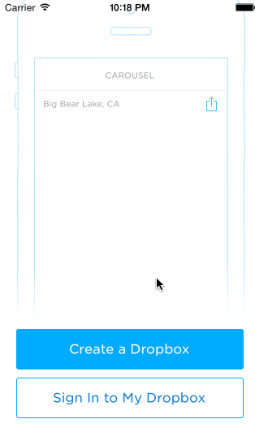

# Week 2 - Carousel Codepath Assignment

- Objective: prototyping, navigation, input handling and validation
- Hours: 8
- Finished: Required elements + Optional Sign Up textfield inputs

Two optionals from the pagination tutorial section
* [x] Optional: Upon reaching the 4th page, hide the dots and show the "Take Carousel for a Spin" button.
* [x] Optional: User can page between the screens with updated dots

